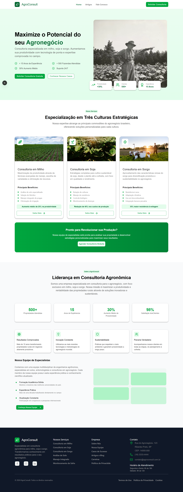

# 🌿 Agro Fatec — Plataforma Web com Payload CMS

Este Projeto é uma consultoria onde tentamos seguir um prototipo do figma para aprender novas tecnologias.
Ele utiliza **Next.js** para o frontend e **Payload CMS** para gerenciamento dinâmico de conteúdo.

---

## 🚀 Tecnologias Utilizadas

| Tecnologia                     | Função                                           |
| ------------------------------ | -------------------------------------------------- |
| **Next.js (App Router)** | Renderização do site e navegação               |
| **React**                | Componentização da interface                     |
| **Payload CMS**          | Painel administrativo e gerenciamento de conteúdo |
| **TypeScript**           | Tipagem estática para melhor manutençã          |
| **FIgma**                | Prototipagem                                       |
| **MUI (Material UI)**    | Biblioteca de UI para componentes visuais          |

---

## ✨ Funcionalidades

- Interface profissional
- Painel administrativo acessível via `/admin`
- Criação e gerenciamento de conteúdo sem editar código
- Seções dinâmicas atualizadas pelo Payload CMS
- **Métricas da seção “Sobre” atualizadas automaticamente**, como:
  - Número de propriedades atendidas
  - Porcentagem de aumento de produtividade
  - Porcentagem de satisfação dos clientes

---

## 🧭 Como Rodar o Projeto Localmente

### 1. Clone o repositório

```bash
git clone https://github.com/Endrewmarra/agro-fatec
cd agro-fatec
```

### 2. Configure variáveis de ambiente

```bash
cp .env.example .env
```

### 3. Instale dependências e execute o projeto

```bash
npm install
npm run dev
```

Acesse:

```
http://localhost:3000
```

---

## 🔐 Acessando o Painel Administrativo

```
http://localhost:3000/admin
```

No primeiro acesso, será solicitado criar um usuário administrador.
Caso encontre problemas, exclua os dados de usario em agro-course.db

---

## 🎯 Objetivo do Projeto

Conhecer ferramentas e ter contato com tecnologias utilizadas para desenvolvimento web

---

## Etapas

- [X] Criar as seções do site como componentes (Header, Appresentation...)
- [X] Definir Componentes para renderizarem como layout (Header e Footer)
- [X] Componentizar os elementos que se repetem em cada seção do site
- [ ] Criar uma pagina NotFound
- [X] Criar rota para outras paginas
- [ ] Adcionar funcionalidade aos botões da pagina
- [ ] Tornar a pagina responsiva

---

## Estado Atual

A página principal foi desenvolvida seguindo os padrões do FIGMA, porem sem preocupações de proporção e resolução de tela, foi desenvolvida com apenas em meu monitor.

[Prototipo no Figma](https://www.figma.com/make/5BS97MSkojVd8CC4Pahpjz/Home-Page-Prototype?node-id=0-1&p=f&t=HZPR6ZGGoCtQqTrY-0)




---

## 📄 Licença

Este projeto tem finalidade acadêmica e demonstrativa.
